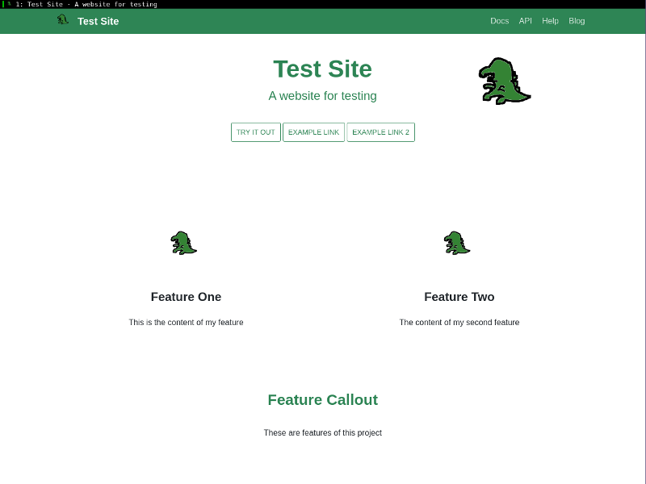

私が真っ暗な部屋で顔にライトを当てる。すかさず ThinkPad が言う。「気持ち悪いです」

「不気味だって言ってよ!もう…」そう言ってライトを消し，部屋の照明をつけると，EeePC も私の奇行につっこんだ。「今の小芝居はなんだ？」「寿命が削られた私の気持ちを表しました」

そうして私は `website` の中からひとつのファイルを表示させる。

`index.js`

その中身が目に入った瞬間，低く鈍い音が反響したかのような錯覚をおぼえた。私が神妙な顔つきになり，ただならぬ雰囲気に EeePC も身構える。

「 `website/pages/en` の中に index.js っていうファイルがあるんだけど」「ああ」「まず読んでみて」

 
<https://github.com/facebook/Docusaurus/blob/master/examples/basics/pages/en/index.js>

    const React = require('react');
    
    const CompLibrary = require('../../core/CompLibrary.js');
    const MarkdownBlock = CompLibrary.MarkdownBlock; /* Used to read markdown */
    const Container = CompLibrary.Container;
    const GridBlock = CompLibrary.GridBlock;
    
    const siteConfig = require(process.cwd() + '/siteConfig.js');
    
    function imgUrl(img) {
      return siteConfig.baseUrl + 'img/' + img;
    }
    
    function docUrl(doc, language) {
      return siteConfig.baseUrl + 'docs/' + (language ? language + '/' : '') + doc;
    }

 
こうした記述は 200 行以上にわたって続いている。まぎれもない Javascript のファイルだ。

「前にさ，Docusaurus のトップページ，見せたでしょ？」「あ？ああ」

私の言葉を聞くなり，ThinkPad は過去のスクリーンショットを検索して画面に表示した。これは Docusaurus をインストールしたとき，説明のために省かれたものだ。簡略化されてはいるものの，レイアウト自体は [公式ページ](https://docusaurus.io/) とほぼ同じである。

 
 

 
「このページね， **さっきのファイルから作られてるんだ** 」

「え」EeePC が驚く。「さっきの index.js からか」

私はうなずく。「そう。だからトップページを変えるには，さっきのファイルを直接いじるしかない」

 
沈黙が場を支配する。React はおろか Javascript を一行も書いたことのないへっぽこに突如として降りかかってきたあまりにも過酷な試練。

 
「私ね」ふいに思い出したように言った。「ああ」「コンピュータに関して，私がやらなきゃいけないことで，もし地球上で誰かができてることなら，私にもできるって，そう思ってるんだ」

EeePC はその言葉を聞き，なつかしい様子で「そうだな」と言った。

「だから，今回も絶対できるって思って，がんばった」「ああ。君はいつでも，その不屈の心で，自分の殻をやぶってきた」「うん，ありがと」

「だがひとつ言っておきたい」EeePC は急に真剣な口調になる。「これまで，そしてこれからのことだ。君は誰かの期待にこたえようとして無茶をしすぎる。そのおかげで君は飛躍的に成長してきたかもしれない。けれども身体を壊しては元も子もないんだ。もっと自分を大切にしてほしい」

何度言われたことか。そのたびに忘れ，そのたびに同じことを言われる。

「君もね」私はそう答えた。

 
「それで，君はどうやって Javascript を書けるようになったんだ？」「ええと，class とか extends ってあるからオブジェクト指向の言語だなっていうのはわかったんだけど」

本当にこいつは Javascript を知らないんだ。EeePC はそう思った。

「でも入門から順番にやって身につけたわけじゃないよ」「え？じゃあどうやったんだ？」

私は [Almin](https://almin.js.org/) のページを見せる。「Almin の公式ページも Docusaurus だったから，これの index.js がどうなってるか読んで勉強させてもらったの。ありがとうございます」「オープンソースはすばらしいな」「うん。それでね，Docusaurus にはレイアウトを作るためのお助け機能があるのがわかったんだ」「お助け機能？」

 
<https://docusaurus.io/docs/en/api-pages>

    const MarkdownBlock = CompLibrary.MarkdownBlock;
    
    <MarkdownBlock>
      [Markdown syntax for a link](http://www.example.com)
    </MarkdownBlock>;

 
「Docusaurus の index.js は Markdown が書けるんだよ」「おお!」「最初は &lt;p&gt; 要素で説明文を書いてたんだけど」「君は html は書けるのか？」「ちょぴっとね。そうしたら React が『 &lt;p&gt; 連発なんてクソコード書くんじゃねえ。key を指定しやがれ』みたいな警告出してきて」

「不適切な言葉は避けてください」ThinkPad が警告を出す。

「ごめん。それでね，すごくこわかったんだけど，でも MarkdownBlock は何行続いても一個のまとまりだから警告も出なくなった」

「じゃあトップページで単に文章を書きたいなら MarkdownBlock が良いんだな？」「ちゃんと書ける人は自由自在だと思う。でも私は書けないから助かった。<https://docusaurus.io/docs/en/api-pages> には他にも役立つ説明がいろいろあるからぜひ読みましょう!」

 
 
(c) 2018 jamcha (jamcha.aa@gmail.com).

